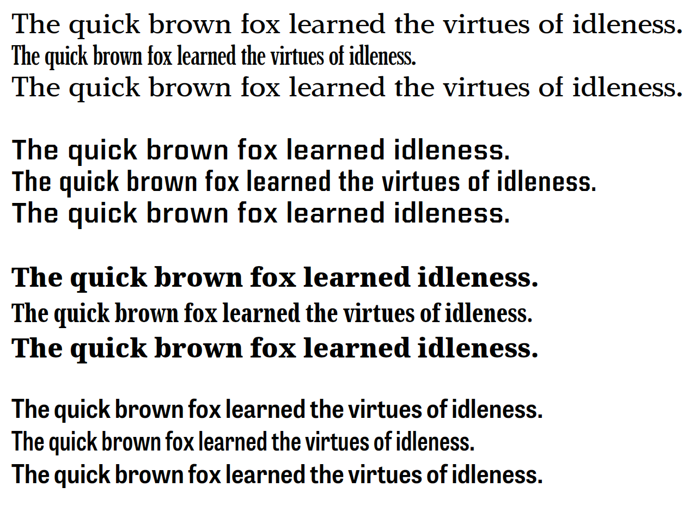

# Introduction

This repository contains a draft proposal for adding a new table, XVAR, to the OpenType specification for variable fonts. This table extends the concepts of the avar table to enable the font designer to warp the external design space of a variable font using multiple axes as part of the mapping. (The avar table can warp the design space, but treats each axis independently. See [The Problem](#The_Problem), below). This multivariable warping can provide several benefits (see also [detailed benefits](#The_Benefits)):

* Reduce file size by reducing the number of required masters (e.g. eliminate corner masters).
* Limit the external design space to ranges that provide good results (e.g. avoid the "Thar be dragons" areas that Petr von Blokland has mentioned in his presentations).
* Iron out font issues late in the design process without introducing intermediate masters. (e.g. your Regular, Bold, Condensed and Bold Condensed look great, but your SemiBold SemiCondensed is not right, so you warp the space to correct, rather than adding an intermediate)
* Provide a mechanism for introducing synthetic axes - i.e. axes that have no gvar data and are purely derived from a combination of axes with gvar data. E.g. synthesizing an optical size (opsz) axis out of David Berlow's [parametric axes](https://variationsguide.typenetwork.com/proposal/). 

The original XVAR proposal was prepared during the development of the OpenType 1.8 spec that introduced Font Variations. At that time, it was not clear to the people working on the specification how important or necessary the XVAR table would be, so it was postponed from version 1.8 and left as a proposal for future development if a strong case was made.

Since the release of OpenType 1.8 and the creation of several multi-axis variable fonts, we as an industry are learning the limitations of the technology, and discussion continues to return to proposals like XVAR. There are two general themes:

1. A need to correct the design space to interpolate per the designer's intention, without having to introduce intermediates, thus increasing file size, and without the tedium of constantly having to redraw masters. (See the first 3 benefits, above).
2. A discussion of dependencies between axes - e.g. meta axes, or synthetic axes. 

The current proposal answers theme #1 above. It could be easily extended to provide a mechanism for synthetic axes; however, I (@robmck-ms) haven't gotten to that yet. 

## Status of the draft proposal

### Background

As mentioned above, this proposal was put together during the creation of the OpenType 1.8 spec. It has not been implemented in code; however, and thus has not been proven to be viable yet. It is merely a draft proposal and and has not been finalized. Before it is finalized, it must be proven by an implementation that tests not only its functionality does what we intend, but works in a way that is performant, easy to understand and extend, etc. 

I have been slowly working on prototyping the ideas in this specification to prove the idea. My intention is to keep working through the issues in the specification and to prototype the ideas in it. However, adoption of variable fonts in their current form (OpenType 1.8.3) is a higher priority, so I will only be able to advance XVAR as time permits. Even with prototype fonts and conceptual models, the spec really needs prototype code implementations in rasterizers to truly validate the implementation.

### Problem: it won't work

As part of this investigation, a mathematician in our group took a look at the proposal and has concluded that it is problematic. First, the proposal increases the level of interdependence between axes, which, when combined with already mutually dependent axes like weight, width, and optical size, could easily create regions that are even more tangled than without XVAR. Second, XVAR could add non-linearities and regions of instability. Thus, XVAR may cause more problems than it solves. 

We're hoping to write this all up more clearly, but as mentioned in the previous section, advancing variable fonts in their current form is a higher priority. 

## Overview of the proposal

### Quick summary

In many typefaces I’ve seen, the weight of text is inconsistent across other axes (e.g. put all the different widths together for a given weight, and the overall typographic color is not constant). The problem is a multidimensional one, and avar only provides single-dimensional mappings (well, multiple, independent, single-dimensional mappings). XVAR provides multidimensional problems that can help with this and other problems. 

### Coming to terms with weight

Having had this discussion with several people, it’s helpful to define terms a bit: when I talk about typographic weight (which I think John called optical weight) – I’m referring to the overall typographic color of a chunk of text on the page. Otherwise, when I mention weight, I’m likely referring to a position on the wght axis (which might have specific impacts on stem weight, etc).

### Some context

One of the main reasons I began lobbying internally for variable fonts back in 2013 was to enable greater automatic typography. Automatic optical size, or headline fitting were prime examples. E.g. you’d have one weight value for all your headlines, and they’d be fitted to the column at runtime by the browser, responsive to device, screen orientation, base text size, etc (all the usual responsive web design stuff). In such a situation, the designer of the page would set all the headlines to the same weight value, but the browser picks a variety of weights at runtime. The designer will want the typographic color of those headlines to match each other, despite them having different widths.  Similarly, with optical size, the page designer will want consistent typographic color across many optical sizes and widths. 

As you can see from above, I’m primarily concerned about the user of a font, in an automatic setting, and only secondarily about the typeface designer insofar as we should have enough infrastructure so that they can do the right things to satisfy the font user’s experience. 

### The Problem

The avar table works great for single dimensional families. It’s working quite nicely in Selawik and Bahnschrift as well as a few other single axis fonts.  

Things get more complicated with multi-axis fonts, though. The avar table applies mappings for each axis independent of each other. For example, if you have a three axis font, avar assumes that the amount of adjustment you need between light and bold is the same amount of adjustment for the condensed as for the regular width as for the expanded. That’s not often the case.

The avar can’t represent this. Sure you can put in a wght mapping, but it must be the same mapping across all weights. Sure, you could throw more gvar deltas at it in intermediates, but that kills the file size benefit that was a paramount justification most of us used to convince our companies to work on variable fonts.

It’s also theoretically true that you could redraw the outlines to be better. If you drew amazingly perfect outlines such that they interpolate the same between light and bold weights for every possible combination of other axes. But, I’ve not seen anyone do this successfully yet.

We can also look at some examples. If you look at [this specimen I created on axis-praxis](http://www.axis-praxis.org/specimens/_BngLqRhtAG), (see image below), you can see several fonts that, when you compare one width against another, both at the same wght, the overall color differs. Sometimes the condensed is lighter, sometimes heavier. 

 

Here's a related problem: gvar is additive. If you build regular, bold, and condensed masters, and let bold condensed be purely interpolated (i.e. no “corner master”), then it will be far darker than your bold, and narrower than your condensed. You’ll have the same problem, but in the other direction for light expanded. 

One remedy is to build the bold condensed corner master whose job is to essentially moderate the deltas from the other two masters. That adds to file size, but perhaps you’re willing to do that. This will work well if your corner master is brilliantly drawn so that the interpolated interior of that quadrant interpolates smoothly without warps, but I’ve not seen that in practice. It’s hard to nail that corner master.

So, is there a way to adjust that corner without introducing another master? The avar table can’t work here because any adjustments you make for each axis apply equally to the full range of the other axes. In other words, using avar to get your condensed bold corner master right, you’ll end up making your bold and condensed wrong (or, rather, because gvar interpolation special cases on-axes instances, bold and regular will be fine, but slightly off axis will be wildly different). 

### The Proposal

The avar table provides a mapping such that:

```
x’ = f(x)
y’ = g(y)
z’ = h(z)
…
```

Each axis gets its own independent mapping of coordinates from one to another, disallowing overlaps, loops, etc, with the mapping dependent only on the coordinate for that axis.

The XVAR table provides a mapping such that:

```
x' = f(x, y, z, …)
y' = g(x, y, z, …)
z' = h(x, y, z, …)
…
```

Each axis gets its own mapping of coordinates, disallowing overlaps, loops, etc, with the mapping dependent on any or all the coordinates of the other axes. Essentially, this lets you warp the rectilinear design space into another polygon while preserving piecewise linearity. In practical terms, this lets you remap wght differently depending on the wdth, opsz, or other axes.  You could warp the square design space to the diamond-shaped quadrilateral such that bold condensed and light expanded land where the designer want them (consistent typographic color).

### The Benefits

This proposal provides a nice way of solving the above problems, as well as others.

1. It allows you to iron out dependencies in a multi-dimensional space. I.e. things look great at your masters, but get unruly or unpredictable in the middle areas. E.g. that font I mentioned that needs wght=600, wdth=100, and wght=523, wdth=75, and wght=610, wdth=150 can be remapped so that wght=600 has consistent typographic color across all width values. Alternatives to XVAR: you could add a bunch of intermediates, but this would increase file size, cost/time to develop, and the design space gets even more warped (this is a sort of whack-a-mole approach).
2. Reduce file size by reducing masters. Corner masters are only really necessary to      reduce influence of on-axis masters at the corners. XVAR lets you adjust that influence without introducing corner masters (and the file size, $cost, and time to develop).
3. Limit the design space to good ranges. (avoiding edges where there be dragons). E.g.      extreme condensed widths are illegible at small sizes, especially at heavy weights, but are great at display sizes. Using an XVAR, you could make the extreme widths less extreme at small sizes and more extreme at large sizes, and also take into consideration weights (e.g. you can go more narrow with a light than an ultrablack, to varying degrees depending on      size). I don’t know of any efficient alternative for this in the spec now.

### Synthetic axes

A synthetic axis has no gvar data associated with it at all; perhaps it is even listed in a separate area of fvar. A synthetic axis is described by a path through the designspace of gvar-based axes (i.e. axes as we currently have defined). When generating an instance, software would use the path to determine which values of gvar-axes correspond to the given synthetic axis coordinate. Then, it would generate a set of deltas on the fly for the synthetic axis, computed from the coordinates of the gvar-based axes. From then on for interpolation, the synthetic axis participates alongside the other axes just like normal (i.e. the interpolator doesn't know synthetic from gvar-based axes at this point). I'll go into more detail on this when I get to writing up the doc I had promised.

One example of where a synthetic axis could be useful is to synthesize an optical axis (opsz, wght, wdth) from parametric axes such as David Berlow's [parametric axes](https://variationsguide.typenetwork.com/proposal/). In this case, the optical axes are purely derived from the parametric ones. Today, to build a variable font with these both parametric and optical axes, you'd have to instantiate masters for the optical axes, even though all this gvar data would be completely redundant.

Conceptually, XVAR simply needs to be extended so you map N axes to N+M axes, where M is the number of synthetic axes with no gvar data. This hasn't yet been done or implemented yet.

All that said, in his [presentation at TypeParis 2018](https://youtu.be/S28HV5LYLwQ?t=1h1m58s), David Berlow pointed out a problem with synthetic axes. In his parametric system, XTRA, YTLC, XOPQ, and YOPQ axis coordinates are objective measures of stem or counter weights per mille of UPM*. They actually measure something tangible in the font. You could build a synthetic axis optical size (opsz) axis out of these. For your 12pt opsz, you'd have a specific set of values of the parametric axes for that size, and for 24pt, you'd have a different set of values. Here's the trouble: if you start with that 12pt, then change only the coordinate of opsz to 24pt, you'll get the right rendering, but the coordinates for the parametric axes will be the same (because we didn't change them). Thus, the value of those parametric axes will not be accurate to the outlines (because within the font in XVAR, they've been remapped), thus these objective measures are now relative measures without an explicit reference outside the font to what they are relative to. 

*Well, they're mostly objective: they are a ratio of font units of stem / UPM, per mille, but which stem they measure is left to the designer. For one designer, it may be the cap O stem; another might use cap H; another might use म. The choice of which stem to use is not part of the parametric axes definition. So, the coordinates are objective within a design framework in which designers use the same stem reference within the font, but relative between design frameworks and also with how each designer implements the reference across the typeface (e.g. if the reference is a vertical stem of cap H, how a particular designer chooses the stem weight for corresponding stems in curved forms like cap O). 

# See also

* Renzhi Li's [proposal for the ZVAR table](https://github.com/be5invis/OTVAR-ZVAR-Table). Similar principle, but does more than linear mapping.
* OpenType [avar table specification](https://docs.microsoft.com/en-us/typography/opentype/spec/avar).
* David Berlow's [parametric axes](https://variationsguide.typenetwork.com/proposal/).

# Contributing

This project welcomes contributions and suggestions.  Most contributions require you to agree to a
Contributor License Agreement (CLA) declaring that you have the right to, and actually do, grant us
the rights to use your contribution. For details, visit https://cla.microsoft.com.

When you submit a pull request, a CLA-bot will automatically determine whether you need to provide
a CLA and decorate the PR appropriately (e.g., label, comment). Simply follow the instructions
provided by the bot. You will only need to do this once across all repos using our CLA.

This project has adopted the [Microsoft Open Source Code of Conduct](https://opensource.microsoft.com/codeofconduct/).
For more information see the [Code of Conduct FAQ](https://opensource.microsoft.com/codeofconduct/faq/) or
contact [opencode@microsoft.com](mailto:opencode@microsoft.com) with any additional questions or comments.

# Legal Notices

Microsoft and any contributors grant you a license to the Microsoft documentation and other content
in this repository under the [Creative Commons Attribution 4.0 International Public License](https://creativecommons.org/licenses/by/4.0/legalcode),
see the [LICENSE](LICENSE) file, and grant you a license to any code in the repository under the [MIT License](https://opensource.org/licenses/MIT), see the
[LICENSE-CODE](LICENSE-CODE) file.

Microsoft, Windows, Microsoft Azure and/or other Microsoft products and services referenced in the documentation
may be either trademarks or registered trademarks of Microsoft in the United States and/or other countries.
The licenses for this project do not grant you rights to use any Microsoft names, logos, or trademarks.
Microsoft's general trademark guidelines can be found at http://go.microsoft.com/fwlink/?LinkID=254653.

Privacy information can be found at https://privacy.microsoft.com/en-us/

Microsoft and any contributors reserve all others rights, whether under their respective copyrights, patents,
or trademarks, whether by implication, estoppel or otherwise.